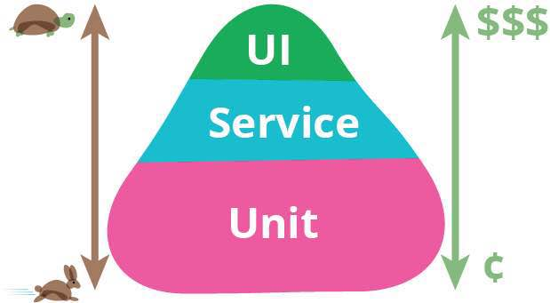

### 接口自动化调研

---
######  为什么要做接口测试
 
 首先我们来看看测试金字塔
 
 
 

---

######  接口测试开始阶段

 
 后台接口开发基本完毕之后，需要开始接口测试，在前端写功能之前对接口进行测试，能够在早期就把接口层的问题暴露出来，后续前端在写功能时能够减少很多由于接口问题导致返工的工作量。
 

---

######  接口测试的目的

1. 在开发接口尽早暴露出接口的问题，减少前端开发的返工工作量。
2. 由于接口测试中会覆盖一些冒烟的业务测试，因此可以在测试环境中定期的执行，减少功能测试经常性的检验环境的重复工作。
 

---

###### 接口测试准备

首先API测试需要与应用程序的API进行交互，为了测试这些API，我们可以：
- 使用测试工具来进行测试
- 自己写代码的方式来进行测试

其次我们需要掌握抓包分析工具，http协议。能够自己去抓包分析。对用户业务熟悉，把接口业务逻辑和用户逻辑结合起来。抓包工具推荐：

- windows推荐使用fiddler
- Mac推荐使用Charles

---

###### 接口测试有那些工具

接口测试常用工具如下：

- Postman 适合接口手工测试
- Jmeter  可结合Ant + jenkins完成接口自动化
- 自己写代码  python + Excel + requests库
- SoapUI

还可以搭建接口自动化测试平台，使接口测试平台化。接下来讲如何使用Jmeter + Ant + jenkins 做接口自动化测试，开始接口自动化测试之旅

---
#### Jmeter + Ant + Jenkins 接口自动化持续集成

###### 为什么要选用Jmeter做接口测试

当选择这套方案的时候，很多人会问，为什么选择Jmeter做Case管理？为什么不自己写框架？说实话，自己写框架有很大优势，比如易于拓展，易于定制。很多大公司都是自己写的框架，有WEB，有简洁的Case编写方式，有很好用的录制方法…以至于我也尝试写过一个（python+unnitest执行+Eexcel管理Case+Htmlrunner报告），但是过程很坎坷，遇到了很多坑（技术积累不足是很重要的一方面）。例如编写Case的时候调试很麻烦，后续拓展需要不断维护（不断封装新的参数获取方法）等等。所以，最终选择了它，大家可以自己尝试体会下。

---

###### Jmeter做接口测试的优势
- Jmeter支持录制，工具有Gui界面，入手相对简单。
- Gui便于调试，本地调试通过上传，管理容易。
- 维护成本很小，Jmeter功能比较全面，不会让自己陷入不停的维护框架的坑。
- Jmeter Case是基于xml的（虽然后缀是jmx格式），执行结果也可以导出xml格式（结果为jtl后缀）

---
###### Jmeter做接口测试的缺陷
- 单条Case执行依赖本地
- Jmeter编写Case有一定学习成本，理论上来说遇到的问题是能解决的，只是这个解决成本很大可能会很大。
- 拓展性稍差，Case基于xml格式管理，后续如果想要自己编写平台，导出这些Case是个不小的工作量。Jmeter作为Apache的顶级项目是开源，可以自行定制，二次开发

---
###### Jmeter+Jenkins+Ant实施方案的适用范围
- 小型公司或小团队。大公司有自己的平台。
- 测试团队较小，没有专门的测试开发部门支持。
- 编程不是很牛逼的，如果你很厉害，自己能搞定所有前端，后台，自己搞比较好。
- 不想将有限的精力放到后期维护当中的

接下来我们来讲一下如何使用Jmeter + Jenkins + Ant 完成接口自动化

 
 
 

